# System Architecture - Mermaid Diagrams

## 1. Overall System Architecture

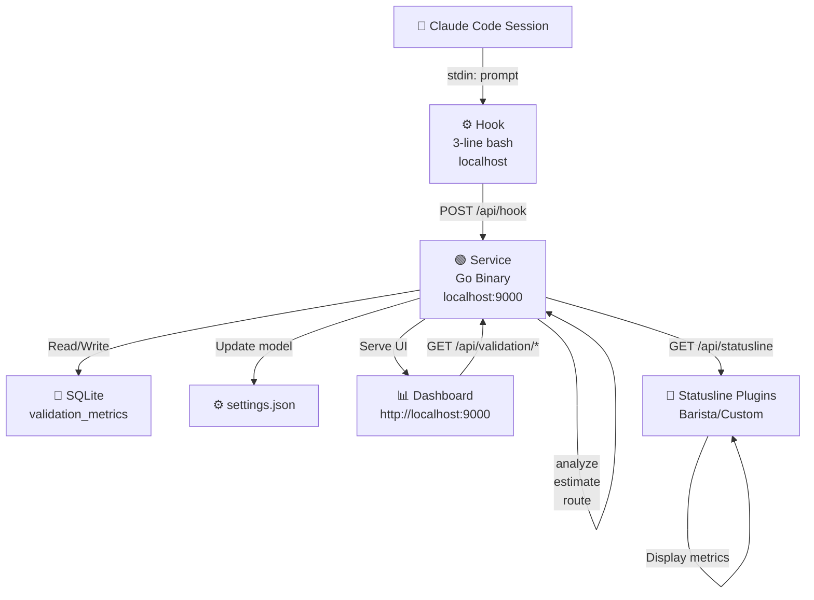

## 2. Pre-Response Flow (Hook Phase)

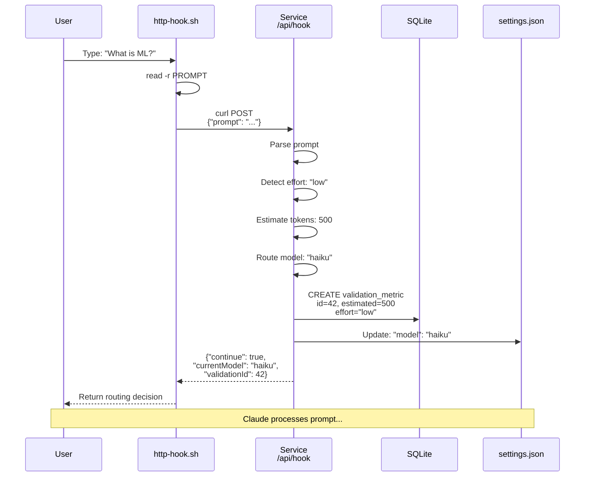

## 3. Post-Response Flow (Validation Phase)

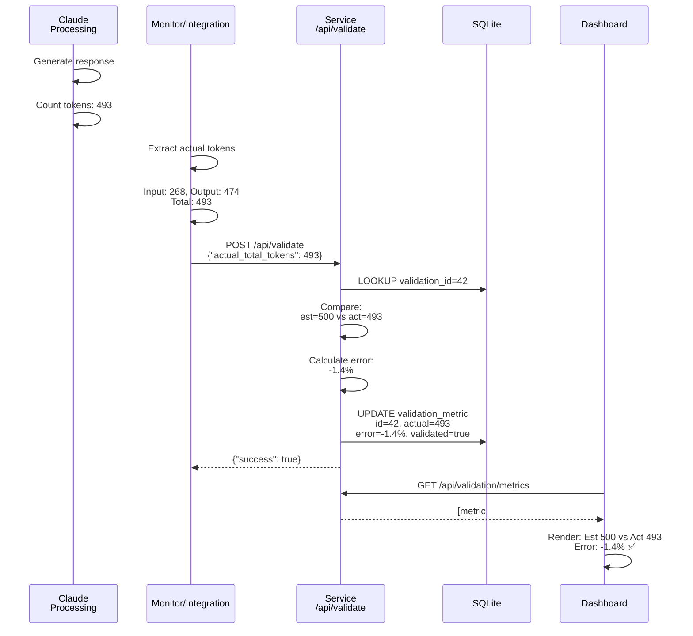

## 4. Statusline Plugin Integration

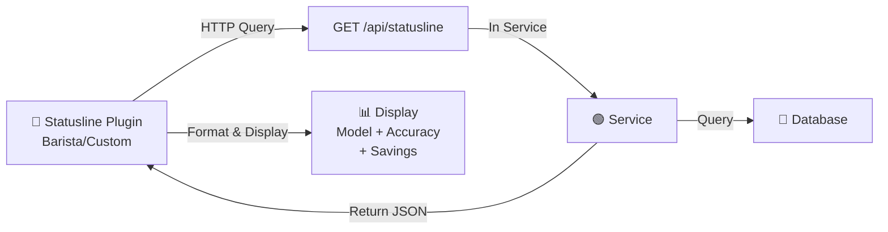

## 5. Full Cycle: User Interaction to Validation

```mermaid
%%{init: { 'theme': 'auto' } }%%
timeline
    title Complete Escalation & Validation Cycle
    
    section PRE-RESPONSE
    00:00 : User types prompt: "What is ML?"
    00:01 : Hook reads stdin
    00:02 : Hook POSTs to /api/hook
    00:05 : Service analyzes prompt
    00:10 : Service detects: low effort
    00:15 : Service estimates: 500 tokens
    00:20 : Service creates validation record (estimate)
    00:25 : Service updates settings.json
    00:30 : Service returns routing decision
    00:35 : Claude Code receives response
    
    section CLAUDE PROCESSING
    00:36 : Claude loads prompt
    01:00 : Claude generates response
    01:50 : Claude counts tokens: 493
    02:00 : Generation complete
    
    section POST-RESPONSE
    02:01 : Monitor/Integration extracts actual tokens
    02:02 : Monitor POSTs to /api/validate
    02:05 : Service receives actual metrics
    02:06 : Service matches estimate to actual
    02:07 : Service calculates error: -1.4%
    02:08 : Service updates validation record (actual)
    02:09 : Database now has complete record
    
    section DASHBOARD
    02:10 : Dashboard refreshes (2s poll)
    02:11 : Dashboard queries /api/validation/metrics
    02:12 : Dashboard displays: Est 500 vs Act 493
    02:13 : Dashboard shows accuracy: 98.6% ✅
    02:14 : Real-time metrics updated
```

## 6. Data Model: Validation Metric

```mermaid
%%{init: { 'theme': 'auto' } }%%
graph TD
    A["ValidationMetric (SQLite Record)"]
    
    A --> B["Identification"]
    B --> B1["ID: 42"]
    B --> B2["Timestamp: 2026-04-25T15:52:00Z"]
    
    A --> C["User Input"]
    C --> C1["Prompt: 'What is ML?'"]
    C --> C2["Task Type: general"]
    
    A --> D["Hook Estimates<br/>Phase 1"]
    D --> D1["DetectedEffort: low"]
    D --> D2["RoutedModel: haiku"]
    D --> D3["EstimatedInputTokens: 27"]
    D --> D4["EstimatedOutputTokens: 500"]
    D --> D5["EstimatedTotalTokens: 527"]
    D --> D6["EstimatedCost: $0.005"]
    
    A --> E["Actual Values<br/>Phase 2"]
    E --> E1["ActualInputTokens: 25"]
    E --> E2["ActualOutputTokens: 474"]
    E --> E3["ActualTotalTokens: 499"]
    E --> E4["ActualCost: $0.00499"]
    
    A --> F["Calculated Errors"]
    F --> F1["TokenError: -5.3%"]
    F --> F2["CostError: -2.0%"]
    F --> F3["Validated: true"]
```

## 7. API Endpoint Architecture

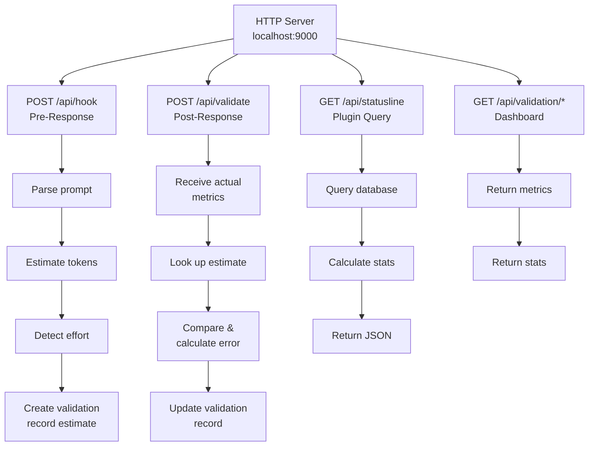

## 8. Information Flow: Hook to Dashboard

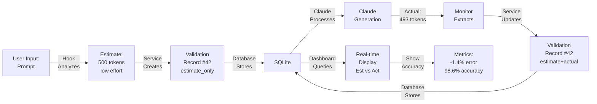

## 9. Component Interaction Matrix

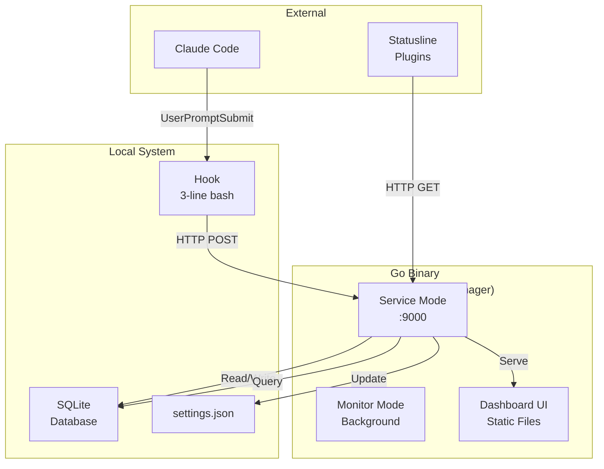

## 10. Deployment Architecture

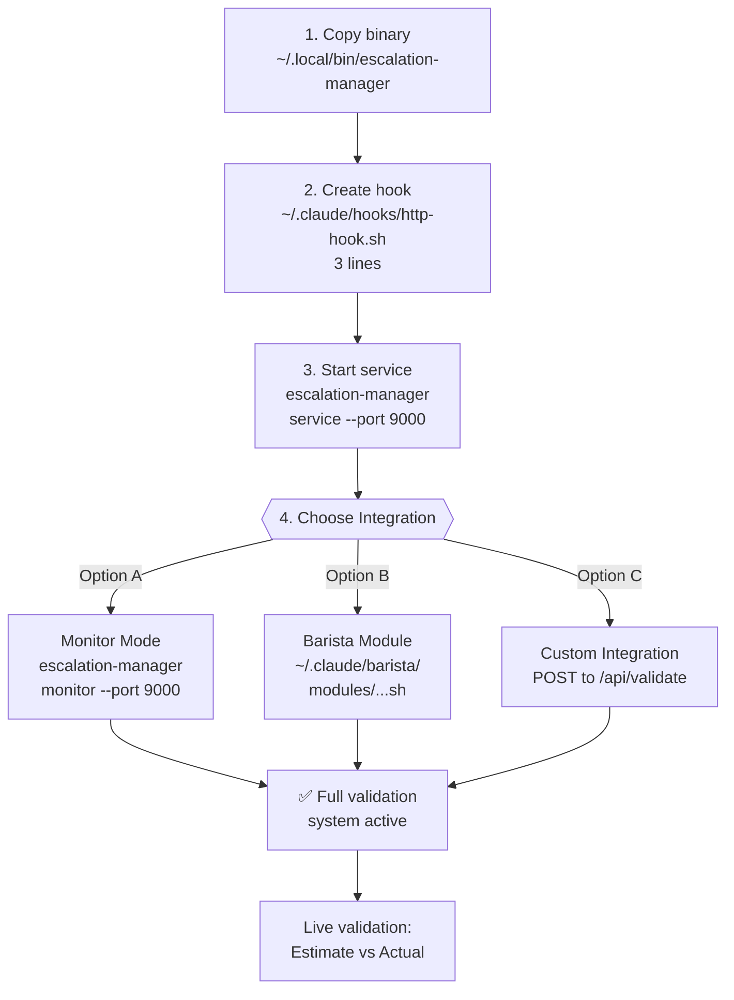

## 11. Data Flow: Hook Analysis

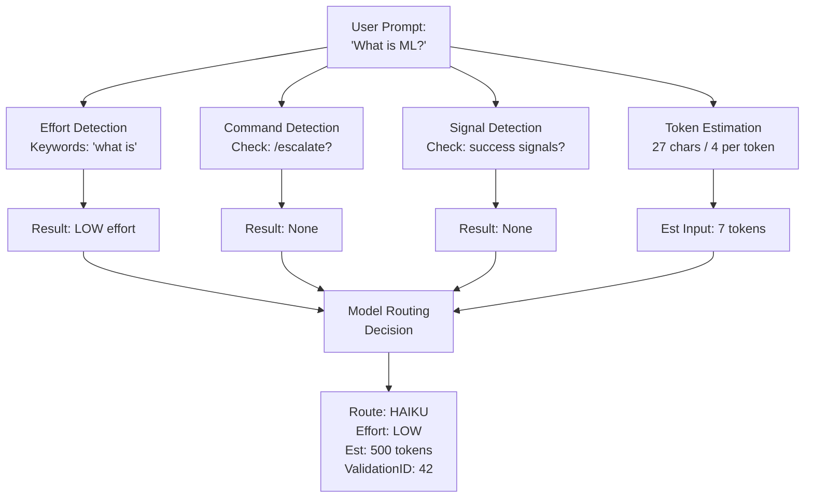

## 12. Validation Statistics Calculation

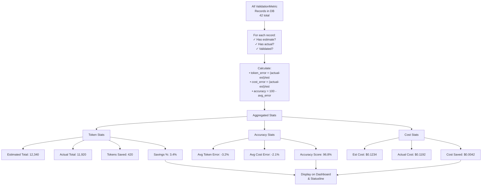

