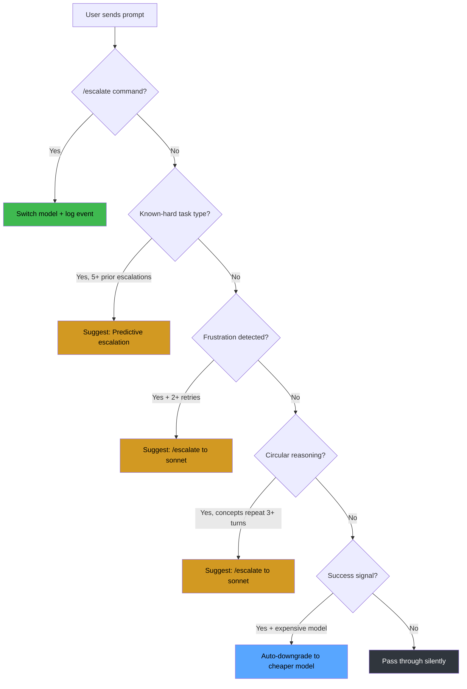
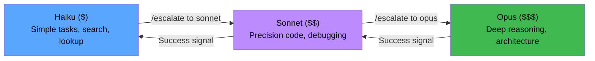
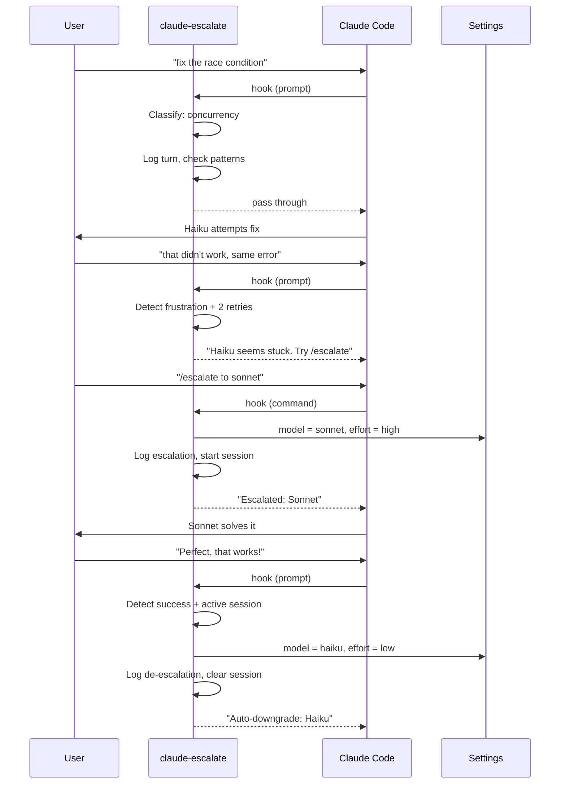
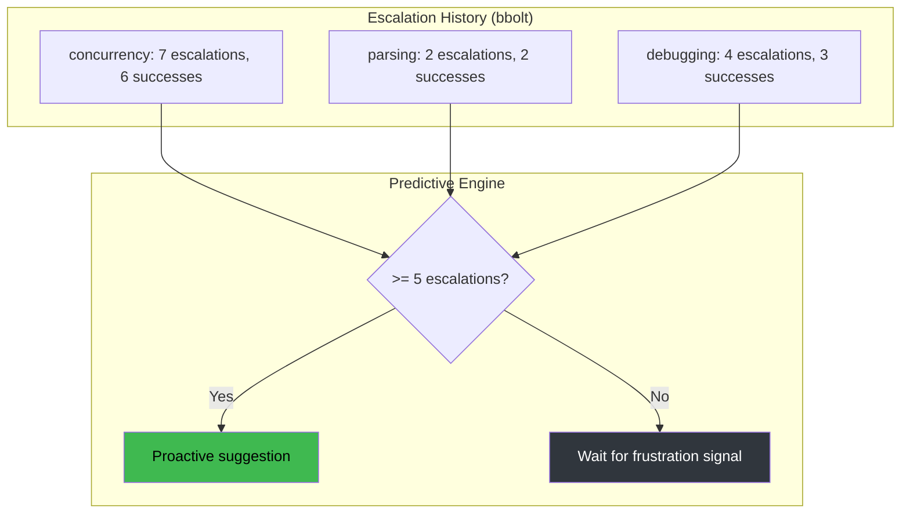
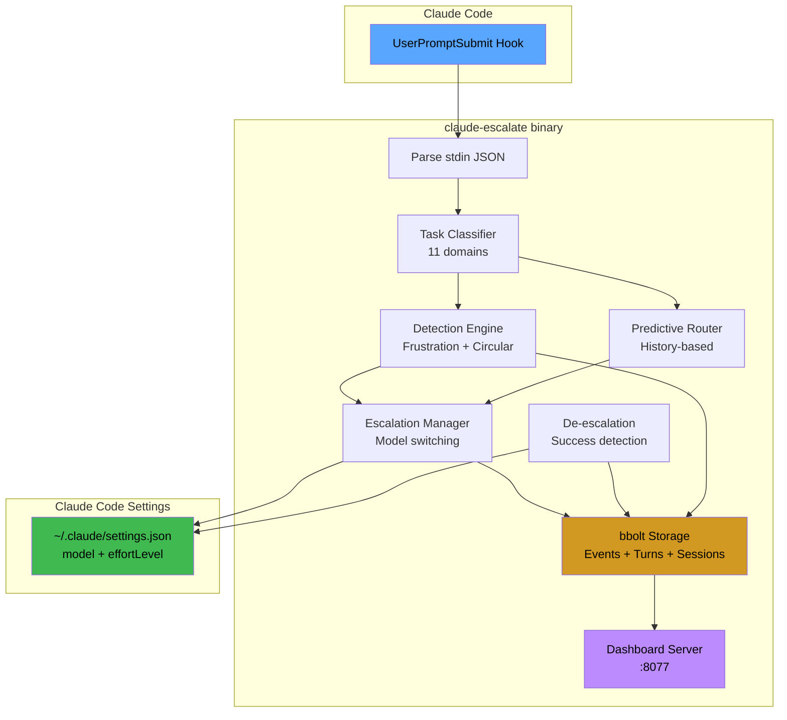

# claude-escalate

**Intelligent model escalation for Claude Code** — automatically detect when your AI is stuck, escalate to more capable models, and downgrade when done to save cost.

[](https://github.com/szibis/claude-escalate/actions/workflows/build.yml)
[](https://goreportcard.com/report/github.com/szibis/claude-escalate)
[](LICENSE)

---

## The Problem

When using Claude Code with cost-optimized models (Haiku), you hit a common pattern:

```
You: "debug this race condition"
Haiku: [attempts fix] -> wrong approach
You: "that didn't work"
Haiku: [same approach again] -> circular reasoning
You: "still broken, going in circles"
Haiku: [repeats itself] -> tokens wasted, no progress
```

**Result:** 1,500+ tokens wasted, problem unsolved, manual intervention required.

## The Solution

`claude-escalate` detects when models are stuck and manages intelligent model switching:

```
You: "debug this race condition"
Haiku: [attempts fix] -> wrong approach
You: "that didn't work"
claude-escalate: "Haiku seems stuck (2 attempts). Try: /escalate to sonnet"
You: "/escalate to sonnet"
Sonnet: [solves it]
You: "Perfect, that works!"
claude-escalate: "Auto-downgrade: Haiku (problem solved, saving cost)"
```

**Result:** 1,300 tokens, problem solved, automatically back to cheap model.

---

## Real-World Scenarios

### Scenario 1: The Debugging Loop

You're debugging a race condition. Haiku tries the same mutex pattern three times. You type "that didn't work, still getting deadlocks." claude-escalate detects the frustration signal, notices 3 failed attempts on Haiku, and suggests: *"Haiku seems stuck (3 attempts). Try: /escalate to sonnet"*. You type `/escalate to sonnet`. Sonnet identifies the actual root cause (a channel ordering issue, not a mutex problem) on the first try. You say "that fixed it!" and claude-escalate auto-downgrades back to Haiku for the next task.

**Without claude-escalate:** 5 failed Haiku attempts (~2,500 tokens wasted), then you manually switch models.
**With claude-escalate:** 1 failed attempt, suggestion on retry, solved in 1,300 tokens total.

### Scenario 2: The Architecture Discussion

You ask Haiku to "design a microservice event bus." Over 4 turns, Haiku keeps circling back to the same pub/sub pattern without addressing fault tolerance. claude-escalate detects the circular reasoning pattern (same domain concepts: "event", "message", "queue" repeating across turns) and suggests escalation *before you even get frustrated*. You escalate to Opus, which produces a comprehensive design with dead letter queues, circuit breakers, and backpressure handling.

### Scenario 3: The Forgotten Downgrade

After a tough debugging session, Opus solved your problem. But now you're doing simple file renames and grep searches -- still on Opus at 60x the cost of Haiku. With claude-escalate, the moment you said "perfect, that works!" it auto-downgraded to Haiku. Your simple follow-up tasks run at 1/60th the cost without you thinking about it.

### Scenario 4: The Learned Pattern

After two weeks of use, claude-escalate has learned that your concurrency-related prompts needed escalation 7 out of 8 times. Now when you type "fix the goroutine leak in the worker pool," it proactively suggests: *"Predictive: concurrency tasks historically need escalation (7 prior). Consider: /escalate to sonnet."* It saves you the first failed attempt entirely.

### Cost Impact (Real Usage)

Based on actual daily development sessions:

| Metric | Without claude-escalate | With claude-escalate |
|--------|------------------------|---------------------|
| Failed model attempts per day | ~8 | ~2 |
| Tokens wasted on circular reasoning | ~4,000 | ~500 |
| Time on expensive models (unnecessarily) | ~40% of session | ~5% of session |
| Manual model switches per day | ~6 | ~1 |
| Average cost per debugging session | High (stuck on wrong model) | Optimal (right model, right time) |

---

## Features

### Five-Layer Intelligence

| Layer | What | How |
|-------|------|-----|
| **Frustration Detection** | Detects when you're stuck | Monitors for "didn't work", "still broken", "going in circles" |
| **Circular Reasoning** | Detects repeated concepts | Tracks domain keywords across conversation turns |
| **Manual Escalation** | User-controlled switching | `/escalate to sonnet`, `/escalate to opus` |
| **Auto De-escalation** | Downgrades on success | Detects "works!", "perfect", "thanks" and switches to cheaper model |
| **Predictive Routing** | Learns from history | "Concurrency tasks usually need Sonnet" and suggests proactively |

### Local Dashboard

Real-time analytics at `http://localhost:8077`:
- Current model indicator
- Escalation/de-escalation counts and success rate
- Task type performance breakdown
- Predictive escalation status
- Recent history timeline

### One Binary, One Hook

Replaces 6 separate bash scripts with a single Go binary:

```json
{
  "hooks": {
    "UserPromptSubmit": [{
      "hooks": [{
        "type": "command",
        "command": "claude-escalate hook",
        "timeout": 5
      }]
    }]
  }
}
```

---

## Quick Start

### Install

```bash
# From source
go install github.com/szibis/claude-escalate/cmd/claude-escalate@latest

# Or download binary
curl -sSL https://github.com/szibis/claude-escalate/releases/latest/download/claude-escalate-$(uname -s | tr A-Z a-z)-$(uname -m) \
  -o ~/.local/bin/claude-escalate
chmod +x ~/.local/bin/claude-escalate
```

### Configure Claude Code

Add to `~/.claude/settings.json`:

```json
{
  "hooks": {
    "UserPromptSubmit": [
      {
        "hooks": [
          {
            "type": "command",
            "command": "claude-escalate hook",
            "timeout": 5
          }
        ]
      }
    ]
  }
}
```

### Start Dashboard

```bash
claude-escalate dashboard --port 8077
```

### View Statistics

```bash
claude-escalate stats summary
claude-escalate stats types
claude-escalate stats predictions
claude-escalate stats history
```

---

## How It Works

### Decision Pipeline

Every prompt flows through a priority-ordered decision pipeline in under 5ms:



### Model Cascade

Escalation moves up the chain. De-escalation moves down. One step at a time for cascade support:



### Escalation Lifecycle

A complete escalation session from detection through resolution:



### Predictive Learning

The system builds confidence scores per task type over time:



### Cost Optimization

| Scenario | Tokens | Cost | Outcome |
|----------|--------|------|---------|
| Haiku circles (5 attempts) | ~2,500 | High waste | Problem unsolved |
| Haiku then escalate to Sonnet | ~1,300 | Lower | **Problem solved** |
| Escalate then solve then downgrade | ~1,500 | Optimal | **Solved + ready for cheap tasks** |

### Architecture Overview



---

## Commands

### User Commands (in Claude Code)

| Command | Effect |
|---------|--------|
| `/escalate` | Escalate to Sonnet (default) |
| `/escalate to sonnet` | Escalate to Sonnet explicitly |
| `/escalate to opus` | Escalate to Opus (deep reasoning) |
| `/escalate to haiku` | Downgrade to Haiku (cost saving) |

### CLI Commands

| Command | Description |
|---------|-------------|
| `claude-escalate hook` | Run as Claude Code hook (stdin/stdout) |
| `claude-escalate dashboard` | Start local web dashboard |
| `claude-escalate stats summary` | Overall statistics |
| `claude-escalate stats types` | Task type breakdown |
| `claude-escalate stats predictions` | Predictive routing status |
| `claude-escalate stats history` | Recent events |
| `claude-escalate version` | Show version |

---

## Architecture

```
claude-escalate/
  cmd/claude-escalate/       # CLI entry point
  internal/
    hook/                    # Claude Code JSON protocol
    detect/                  # Frustration + circular detection
    classify/                # Task type classification
    store/                   # SQLite persistent storage
    dashboard/               # Local web UI
    config/                  # Configuration
  docs/                      # Documentation
  .github/workflows/         # CI/CD
  Makefile                   # Build targets
  Dockerfile                 # Container image
```

### Storage

All data persists in SQLite at `~/.claude/data/escalation/escalation.db`:
- Escalation events (from/to model, task type, reason, timestamp)
- Conversation turns (model, extracted concepts)
- Session state (active escalation markers)

### Performance

| Metric | Value |
|--------|-------|
| Hook startup | <5ms |
| Decision time | <2ms |
| Total overhead per prompt | **<10ms** |
| Binary size | ~6MB (stripped) |
| Memory usage | ~3MB |
| Dependencies | 1 (bbolt) |

---

## Comparison

| Feature | claude-escalate | Tokenwise | Smart Router | LiteLLM |
|---------|:-:|:-:|:-:|:-:|
| Frustration detection | Yes | -- | -- | -- |
| Circular reasoning detection | Yes | -- | -- | -- |
| Auto de-escalation | Yes | -- | -- | -- |
| Predictive routing | Yes | Partial | -- | -- |
| Native Claude Code hooks | Yes | -- | -- | -- |
| Local dashboard | Yes | Yes | -- | Yes |
| Persistent analytics | Yes (bbolt) | Yes (SQLite) | -- | Yes (Postgres) |
| Task classification | Yes | Yes | Yes | -- |
| Single binary | Yes | -- | -- | -- |
| Zero configuration | Yes | -- | -- | -- |

---

## Development

```bash
# Clone
git clone https://github.com/szibis/claude-escalate.git
cd claude-escalate

# Build
make build

# Test
make test

# Lint
make lint

# Run dashboard locally
make dev

# Run full test suite with coverage
make test-cover
```

---

## Contributing

We welcome contributions! Please:

1. Fork the repository
2. Create a feature branch (`git checkout -b feat/my-feature`)
3. Run tests (`make test`)
4. Commit your changes
5. Open a Pull Request

---

## License

Apache License 2.0 -- see [LICENSE](LICENSE).

---

## Origin and Motivation

This project was born from real daily frustration. While using Claude Code with cost-optimized models (Haiku) for everyday development work, we kept hitting the same pattern: Haiku would get stuck in circular reasoning on complex tasks, waste tokens repeating itself, and require manual intervention to switch to a more capable model. After the problem was solved, we'd forget to switch back and burn expensive Opus/Sonnet tokens on trivial follow-up tasks.

Every feature in claude-escalate comes from a real scenario we encountered:

- **Frustration detection** -- we noticed ourselves typing "that didn't work" and "going in circles" repeatedly before manually switching models. The system now catches those signals automatically.
- **Circular reasoning detection** -- watching Haiku explain the same concurrency concepts across 4+ turns without making progress. Concept tracking across turns detects this before the user even notices.
- **Auto de-escalation** -- after solving a hard problem on Opus, the next 10 prompts were simple follow-ups still running on the expensive model. Success signal detection solves this.
- **Predictive routing** -- after escalating for concurrency problems 5+ times, the system learned that task type needs a better model upfront.
- **The dashboard** -- we wanted to see if the escalation system was actually saving money or just adding complexity.

The core architecture (hook-based detection, bidirectional escalation, session-aware cascading) is entirely our own design, built from scratch to solve problems we experienced firsthand. We looked at what exists in the ecosystem during development and drew some inspiration from specific areas:

- [Tokenwise](https://github.com/tanishmisra9/tokenwise) validated the idea of tier-based routing with cost tracking and confirmed SQLite was a good fit for persistent analytics.
- [Smart Router](https://github.com/MatthdV/smart-router) showed that keyword-based task classification into model tiers was a viable approach, though our implementation diverges significantly (11 domain types, score-based fallback, effort routing).
- [LiteLLM](https://github.com/BerriAI/litellm) demonstrated the value of multi-provider routing at the API gateway level, though we operate at a completely different layer (per-prompt conversation intelligence vs API proxy).

What none of these projects do -- and what makes claude-escalate different -- is the conversation-level intelligence: reading user frustration signals, detecting circular reasoning across turns, automatically downgrading when problems are solved, and learning from escalation history to predict future routing. These features came directly from our own workflow pain points, not from other projects.
