# Mermaid Diagrams Guide

All documentation diagrams use Mermaid and support light/dark mode automatically.

## Supported Diagram Types

### 1. Flowchart (Used Most Often)

Shows process flows and decision trees:

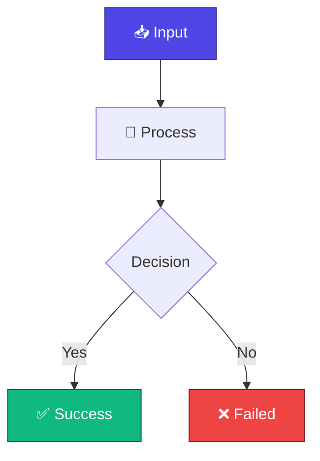

**Best for**:
- Optimization pipeline flows
- Request processing paths
- Decision trees
- User workflows

### 2. Sequence Diagram

Shows interaction between components:

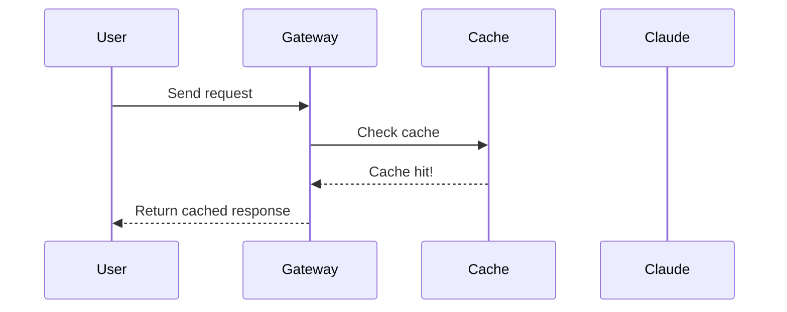

**Best for**:
- Request/response flows
- Component interactions
- System communication

### 3. Graph/Node Diagram

Shows relationships and hierarchies:

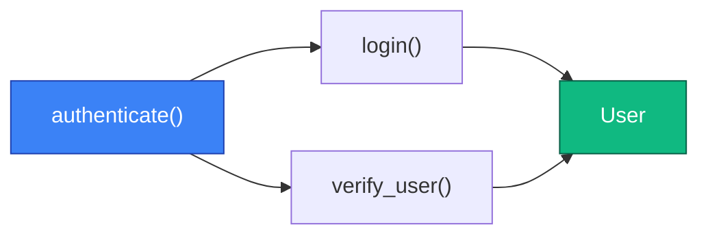

**Best for**:
- Knowledge graph relationships
- Class hierarchies
- Dependency trees
- Code relationships

## Color Scheme

All diagrams use CSS variables for automatic light/dark compatibility:

| Use Case | Color | Hex | When |
|----------|-------|-----|------|
| Input/Start | Primary Blue | #4F46E5 | Initial state, inputs |
| Success/Output | Green | #10B981 | Positive results, cache hits |
| Error/Blocked | Red | #EF4444 | Failures, security blocks |
| Processing/Steps | Amber | #F59E0B | Intermediate steps, layers |
| Info/Details | Cyan | #3B82F6 | Additional information |
| Secondary/Alternative | Purple | #8B5CF6 | Alternative paths |

## Examples by Document

### README.md

**Optimization Pipeline** (7-layer flow):
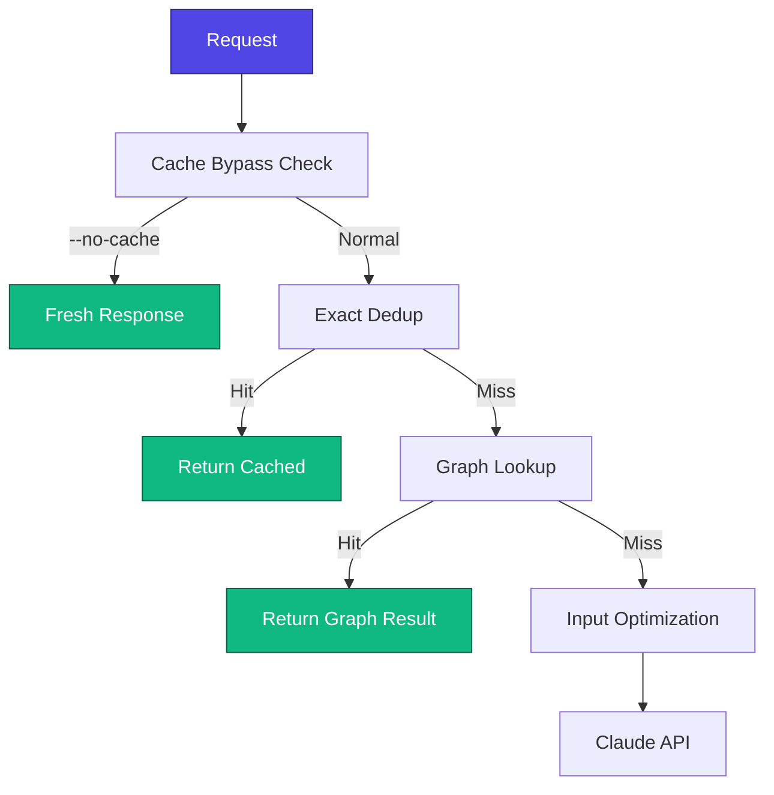

### KNOWLEDGE_GRAPH.md

**Indexing Pipeline** (file → graph):
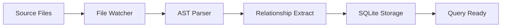

**Query Flow** (question → answer):
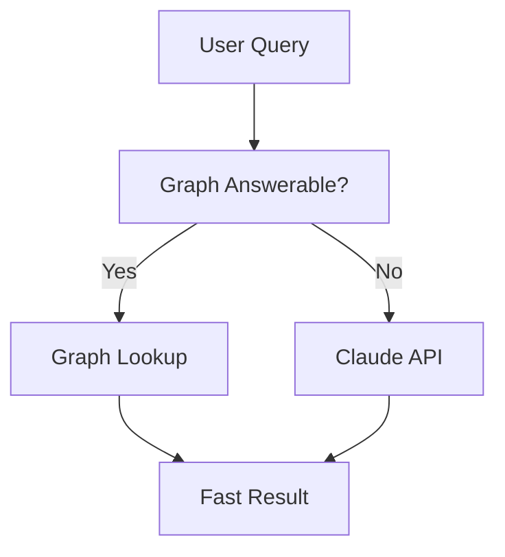

### INPUT_OPTIMIZATION.md

**Optimization Layers** (input → output):
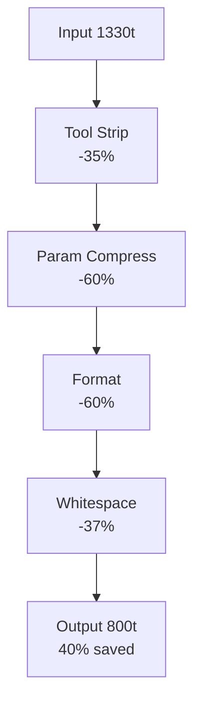

## Light/Dark Mode Support

All diagrams automatically adapt to system theme:

```html
<!-- In documentation HTML head -->
<style>
  @media (prefers-color-scheme: dark) {
    :root {
      --mermaid-primary: #6366F1;      /* Lighter blue for dark mode */
      --mermaid-success: #34D399;      /* Lighter green for dark mode */
      /* etc */
    }
  }
</style>

<!-- Mermaid will use these CSS variables -->
<div class="mermaid">
  graph TD
    A["Input"] --> B["Process"]
    style A fill:var(--mermaid-primary),stroke:var(--mermaid-primary-dark),color:#fff
</div>
```

## Rendering

### GitHub

Mermaid diagrams render automatically in GitHub markdown:

```markdown
# My Diagram


No special setup needed.
```

### Local/HTML

Mermaid requires a script tag:

```html
<script src="https://cdn.jsdelivr.net/npm/mermaid/dist/mermaid.min.js"></script>
<script>
  mermaid.initialize({ startOnLoad: true, theme: 'default' });
</script>

<div class="mermaid">
  graph TD
    A --> B
</div>
```

### VS Code

Install "Markdown Preview Mermaid Support" extension:

```bash
code --install-extension bierner.markdown-mermaid
```

Then view diagrams in preview pane.

## Best Practices

### 1. Use Descriptive Labels

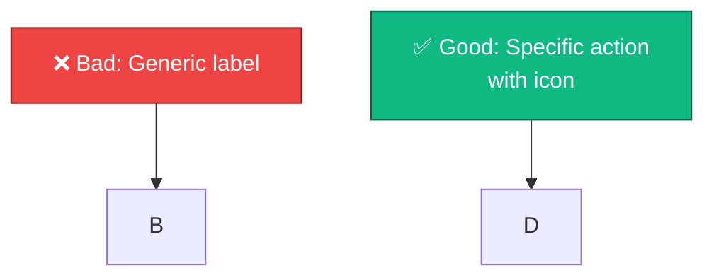

### 2. Add Emojis for Quick Recognition

- 📥 Inputs/Data
- 🔧 Processing/Tools
- 💾 Storage/Cache
- 🤖 AI/Claude
- ✅ Success
- ❌ Error
- ⚡ Fast/Efficient
- 🔒 Security

### 3. Use Consistent Styling

Always use CSS variables for colors, not hardcoded hex:

```mermaid
graph TD
    A["Use Variables"] 
    style A fill:var(--mermaid-primary),stroke:var(--mermaid-primary-dark),color:#fff
    
    B["NOT: Hardcoded"]
    style B fill:#4F46E5,stroke:#312E81,color:#fff
```

### 4. Keep Diagrams Simple

If a diagram needs many nodes (>15), break it into multiple diagrams:

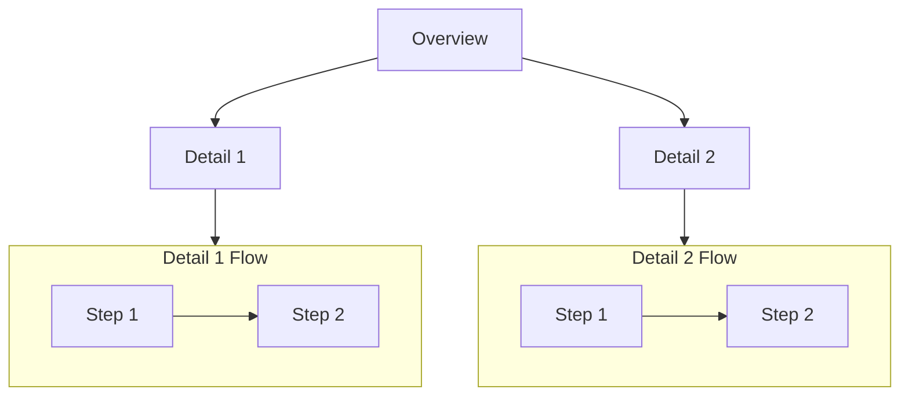

### 5. Show Data Flow

Include token counts, timing, or resource usage:

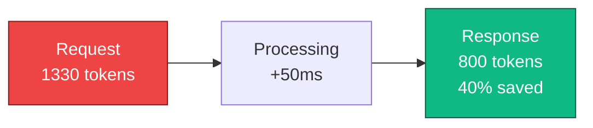

## Common Patterns

### Decision Point

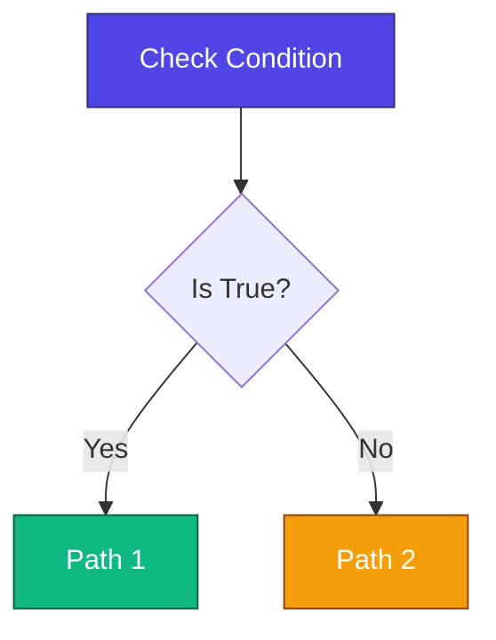

### Parallel Paths

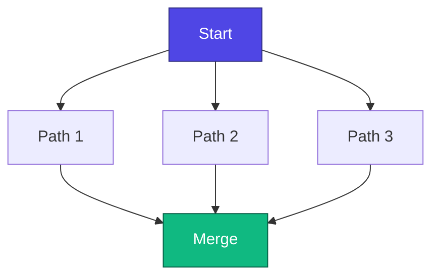

### Feedback Loop

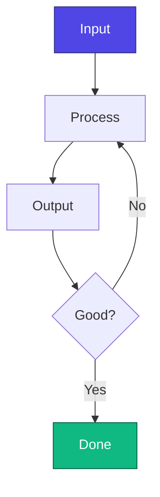

## Testing Diagrams Locally

View mermaid rendering in VS Code:

1. Open markdown file
2. Press `Ctrl+K V` (or `Cmd+K V` on Mac)
3. Mermaid diagrams render in preview pane
4. System dark/light mode preference applies automatically

## Updating Existing Diagrams

When updating ASCII diagrams to Mermaid:

1. **Keep the information** — Mermaid should show the same flow
2. **Add visual hierarchy** — Color code by function (input, process, output)
3. **Use emojis** — Quick visual recognition
4. **Test in dark mode** — Ensure contrast is sufficient
5. **Simplify if needed** — Break large diagrams into smaller ones

## References

- [Mermaid Documentation](https://mermaid.js.org/)
- [Mermaid Live Editor](https://mermaid.live/) — Test diagrams online
- [CSS Variables Reference](https://developer.mozilla.org/en-US/docs/Web/CSS/--*) — For theming
