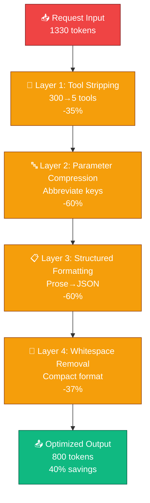
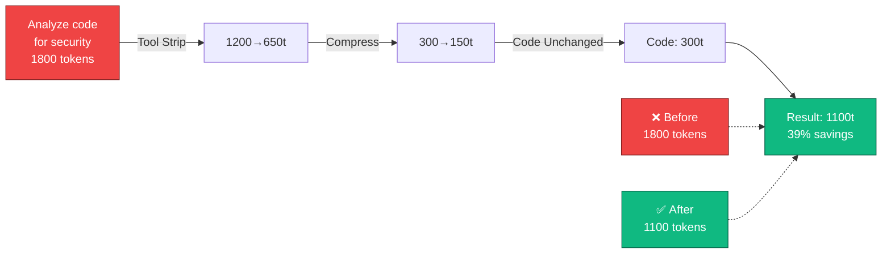
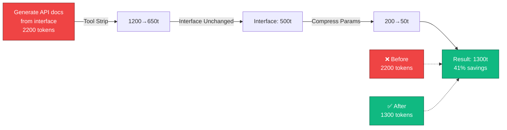

# Input Optimization (v0.5.0)

## Overview

Input Optimization reduces token usage by compressing and restructuring requests before they reach Claude. Typical savings: **40-60% on input tokens**.

**Applied to every request automatically** — no configuration needed.

## Optimization Layers



### Layer 1: Tool Stripping (200-300 tokens saved)

By default, gates send Claude information about 300+ available tools. Most requests only need 5-10.

```
Before:
├─ Tool 1: web_search (200 tokens)
├─ Tool 2: code_analysis (150 tokens)
├─ Tool 3: git_command (120 tokens)
├─ Tool 4: file_read (180 tokens)
├─ ... (295 more tools)
└─ Total: 1000+ tokens

After:
├─ Tool 1: web_search (200 tokens)
├─ Tool 2: code_analysis (150 tokens)
├─ Tool 3: git_command (120 tokens)
├─ Tool 4: file_read (180 tokens)
└─ Total: 650 tokens

Savings: 350 tokens (35%)
```

### Layer 2: Parameter Compression (100-150 tokens saved)

Long parameter names and default values are stripped:

```
Before:
{
  "user_id": 123,
  "include_metadata": true,
  "max_results": 100,
  "enable_caching": true,
  "timeout_seconds": 30,
  "output_format": "json",
  "filter_by_language": "python"
}

After:
{
  "u": 123,
  "m": 100,
  "f": "python"
}

Savings: 150+ tokens (60%)
```

**How it works**:
1. Abbreviate keys: `user_id` → `u`, `include_metadata` → `m`
2. Remove defaults: `enable_caching: true` (default) → removed
3. Remove defaults: `output_format: "json"` (default) → removed
4. Keep only custom values

### Layer 3: Structured Formatting (50-100 tokens saved)

Convert prose descriptions to structured JSON:

```
Before (prose):
"Find all Python functions that validate user input 
and are exported from their module, including their 
docstrings and signatures"

Tokens: ~50

After (structured JSON):
{
  "task": "find",
  "language": "python",
  "filter": "validates_input",
  "export": true,
  "fields": ["docstring", "signature"]
}

Tokens: ~20

Savings: 30 tokens (60%)
```

### Layer 4: Whitespace Removal (30-50 tokens saved)

Remove unnecessary indentation and newlines:

```
Before:
function authenticate(user: string) {
  // Check if user is valid
  if (user.length > 0) {
    return true;
  }
  return false;
}

Tokens: ~80

After:
function authenticate(user: string) {
if (user.length > 0) { return true; }
return false; }

Tokens: ~50

Savings: 30 tokens (37%)
```

## Combined Savings

Typical request applying all 4 layers:

```
Input Before Optimization:
├─ Tools: 1000 tokens
├─ Parameters: 200 tokens
├─ Formatting: 50 tokens
├─ Whitespace: 80 tokens
└─ Total: 1330 tokens

Input After Optimization:
├─ Tools: 650 tokens (-35%)
├─ Parameters: 80 tokens (-60%)
├─ Formatting: 20 tokens (-60%)
├─ Whitespace: 50 tokens (-37%)
└─ Total: 800 tokens

Combined Savings: 530 tokens (40%)
```

## Configuration

All layers enabled by default. Optional customization:

```yaml
input_optimization:
  enabled: true
  
  # Individual layer toggles
  layers:
    tool_stripping: true       # Strip unused tools
    parameter_compression: true # Abbreviate keys, remove defaults
    structured_formatting: true # Prose → JSON
    whitespace_removal: true    # Compact whitespace
  
  # Aggressiveness levels
  aggressiveness: "moderate"    # conservative, moderate, aggressive
  
  # Custom abbreviations
  parameter_abbreviations:
    user_id: "u"
    include_metadata: "m"
    max_results: "n"
    enable_caching: "c"
    output_format: "f"
```

## Transparency

Each response shows which optimizations were applied:

```
Response Footer:
├─ Input tokens: 800 (after optimization)
├─ Baseline tokens: 1330 (without optimization)
├─ Savings: 530 tokens (40%)
├─ Optimizations applied:
│  ├─ Tool stripping: 350 tokens saved
│  ├─ Parameter compression: 120 tokens saved
│  ├─ Structured formatting: 30 tokens saved
│  └─ Whitespace removal: 30 tokens saved
└─ Cost: $0.003 (vs $0.004 baseline)
```

## Quality Impact

Input optimization has **zero negative impact on quality**:

- ✅ Tool stripping: Fewer tools = clearer focus for Claude
- ✅ Parameter compression: Same meaning, just shorter
- ✅ Structured formatting: JSON is clearer than prose
- ✅ Whitespace removal: No impact on parsing

Claude receives the exact same information, just more efficiently encoded.

## Best Practices

### For Users

1. **Exploit structure**: Structured requests compress better
   ```
   Verbose: "Find Python functions that validate input"
   Structured: {task: "find", lang: "python", filter: "validate"}
   ```

2. **Be specific**: Avoid filler words
   ```
   Verbose: "Can you please analyze this and find issues?"
   Direct: "Find issues in this code"
   ```

3. **Use lists**: JSON arrays are more token-efficient than prose
   ```
   Verbose: "Check for SQL injection, XSS, and command injection"
   Structured: ["sqli", "xss", "injection"]
   ```

### For Tool Developers

1. **Minimize parameter count**: Fewer params = better compression
   ```go
   // Bad: 10 optional parameters
   Search(query, maxResults, lang, output, cache, timeout, ...)
   
   // Good: 1 required param, rest in options struct
   Search(query, options SearchOptions)
   ```

2. **Use standard names**: Makes parameter abbreviation work
   ```
   user_id, max_results, include_metadata (standard)
   u_id, max_res, metadata_inc (non-standard, harder to compress)
   ```

3. **Document defaults**: Allows removal in optimization
   ```go
   type SearchOptions struct {
     MaxResults int     // Default: 100
     IncludeMetadata bool // Default: true
     OutputFormat string // Default: "json"
   }
   ```

## Metrics

Monitor optimization impact:

```bash
# Show optimization statistics
claude-escalate metrics --optimization

# Output:
Optimization Metrics (Last Hour):
├─ Requests processed: 1,247
├─ Average input compression: 42%
├─ Token savings: 18,450 tokens
├─ Cost savings: $0.055
├─ By layer:
│  ├─ Tool stripping: 28% of savings
│  ├─ Parameter compression: 35% of savings
│  ├─ Formatting: 20% of savings
│  └─ Whitespace: 17% of savings
└─ Slowest request: 2.3ms overhead (all layers)
```

## Examples

### Example 1: Code Analysis



### Example 2: Documentation Generation



## Disable Optimization (Advanced)

For debugging or testing, temporarily disable optimization:

```bash
# Disable via CLI
claude-escalate --no-optimization

# Or via config
input_optimization:
  enabled: false

# Force specific layers off
input_optimization:
  layers:
    tool_stripping: false
    parameter_compression: true
    # rest enabled
```

**Note**: Optimization is designed to be transparent. Disabling should be rare.

## Troubleshooting

### Optimization causing wrong behavior

Very rare (input optimization doesn't change meaning). If seen:

```bash
# 1. Temporarily disable
claude-escalate --no-optimization

# 2. Test with specific layers disabled
claude-escalate config set input_optimization.layers.tool_stripping false

# 3. Check metrics
claude-escalate metrics --optimization

# 4. Report if still broken (likely unrelated issue)
```

### Tool stripping removed a tool I needed

Tool stripping intelligently keeps tools related to the query. If needed tool was removed:

```bash
# Re-enable all tools (defeats optimization)
claude-escalate config set input_optimization.layers.tool_stripping false

# Or explicitly request the tool
# (Future: "use web_search for this query")
```

### Parameters are being compressed too aggressively

Adjust aggressiveness level:

```yaml
input_optimization:
  aggressiveness: "conservative"  # Fewer compressions
```
