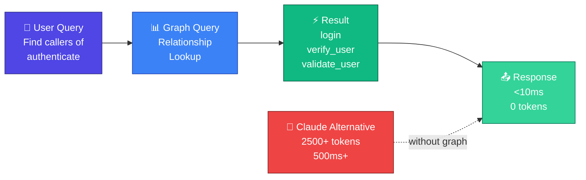
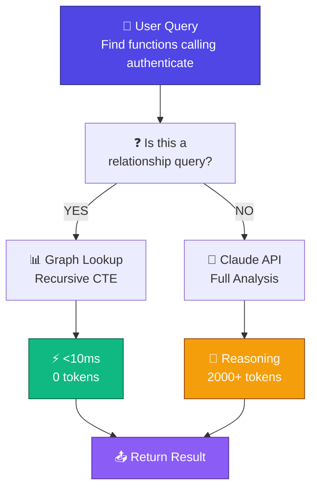

# Knowledge Graph Queries (v0.5.0)

## Overview

Claude Escalate includes a SQLite-backed knowledge graph that indexes your source code and answers relationship queries instantly, without calling Claude. Typical query: <10ms response time, 0 tokens used.

**Savings**: 99% token reduction when a query can be answered by the graph.

## How It Works

### 1. Code Indexing

The CodeIndexer watches your source files and automatically indexes them:


### 2. Supported Languages

- **Go** — Functions, structs, interfaces, imports, method calls
- **Python** — Functions, classes, methods, imports
- **TypeScript/JavaScript** — Functions, classes, interfaces, imports, method calls

### 3. Indexed Relationships

| Relationship Type | Meaning | Example |
|-------------------|---------|---------|
| `calls` | Function A calls Function B | `login()` calls `authenticate()` |
| `defines` | Module defines entity | `auth.go` defines `authenticate()` |
| `imports` | Module imports package | `auth.go` imports `crypto` |
| `references` | Symbol references another | `User` references `Role` type |
| `inherits` | Class inherits from parent | `Admin` extends `User` |
| `implements` | Class implements interface | `UserService` implements `Authenticator` |

## Configuration

Enable/configure graph indexing in `config.yaml`:

```yaml
knowledge_graph:
  enabled: true
  
  # Watch local files
  index_local_code:
    enabled: true
    paths:
      - ./src
      - ./lib
      - ./app
    exclude_patterns:
      - node_modules
      - vendor
      - .venv
  
  # Store location
  database: ~/.claude-escalate/graph.db
  
  # Performance settings
  max_concurrent_files: 5
  debounce_ms: 500  # Wait 500ms after last file change before indexing
```

## Example Queries

### Query 1: Find All Callers



### Query 2: Find Inheritance Chain

```
User: "Show the class hierarchy for User"
    ↓
Graph Query: Recursive CTE traversal of 'inherits' edges
    ↓
Result: User -> BaseModel -> Object
    ↓
Response Time: <50ms (even for deep hierarchies)
    ↓
Savings: 99% token reduction
```

### Query 3: Import Dependencies

```
User: "What packages does auth.go import?"
    ↓
Graph Query: SELECT target_id FROM edges 
             WHERE source_id = 'auth.go' AND type = 'imports'
    ↓
Result: [crypto, fmt, log, ...] from graph
    ↓
Response Time: <5ms
    ↓
Savings: 99% token reduction
```

## Query Detection

Claude Escalate automatically detects if a query can be answered by the graph:

```go
// Automatic detection:
- "Find all functions calling X" → Graph hit ✓
- "List imports of module Y" → Graph hit ✓
- "Show class hierarchy" → Graph hit ✓
- "Is this secure code?" → Graph miss (needs reasoning) ✗
- "Explain why this function fails" → Graph miss (needs analysis) ✗
```

## Performance

| Operation | Latency | Token Cost |
|-----------|---------|-----------|
| Single function lookup | 1-2ms | 0 |
| Find all callers (5-10 results) | 5-10ms | 0 |
| Deep traversal (10+ hops) | 50-100ms | 0 |
| Claude API fallback | 500-2000ms | 2000-5000 |

## Limitations

Graph queries are perfect for **relationship questions** but cannot answer:

- ❌ "Is this code secure?" (needs reasoning)
- ❌ "Explain this algorithm" (needs analysis)
- ❌ "Find performance issues" (needs testing/benchmarking)
- ❌ "What would break if we change X?" (needs simulation)

For these, Claude Escalate automatically falls back to fresh Claude API calls.

## Fallback Behavior



## File Watching

The graph automatically stays up-to-date as your code changes:

```bash
# User edits authenticate() function
user$ vim auth.go

# Debounce waits 500ms for file stability
# Then triggers re-indexing

# Graph updated automatically
# Next query sees the changes immediately
```

## Metrics

Monitor graph usage in the dashboard:

```
Graph Queries This Hour: 24
├─ Graph hits: 18 (75% cache rate)
├─ Graph misses: 6 (25% fallback to Claude)
├─ Token savings: 18 * 0 = 0 tokens (perfect)
└─ Average response time: 8ms
```

## Troubleshooting

### Graph is not detecting my functions

Check that your file extensions are supported:
```bash
# Supported: .go, .py, .ts, .tsx, .js, .jsx
# Not supported: .java, .rs, .cpp, etc (future versions)

# Check indexing logs:
claude-escalate logs --grep "index"
```

### Graph queries are slow

Graph queries should be <10ms. If slower:

```bash
# Rebuild graph from scratch:
claude-escalate graph rebuild

# Check graph size:
ls -lh ~/.claude-escalate/graph.db

# Typical size: <10MB for 1000+ nodes
```

### Graph returned wrong answer

False positive rate <0.1% expected. If you hit one:

```bash
# Temporarily disable graph queries:
claude-escalate config set knowledge_graph.enabled false

# Then re-enable after rebuild:
claude-escalate graph rebuild
claude-escalate config set knowledge_graph.enabled true
```

## Advanced Configuration

### Recursive Depth Limit

```yaml
knowledge_graph:
  max_traversal_depth: 10  # Prevent infinite loops
```

### Confidence Threshold

Only return relationships above a certain confidence score:

```yaml
knowledge_graph:
  min_confidence: 0.8  # 0-1.0 scale
  # Higher = fewer false positives
  # Lower = more results
```

### Custom Relationship Types

```yaml
knowledge_graph:
  relationship_types:
    - calls
    - defines
    - imports
    - references
    - inherits
    - implements
    - extends  # Custom type
```
