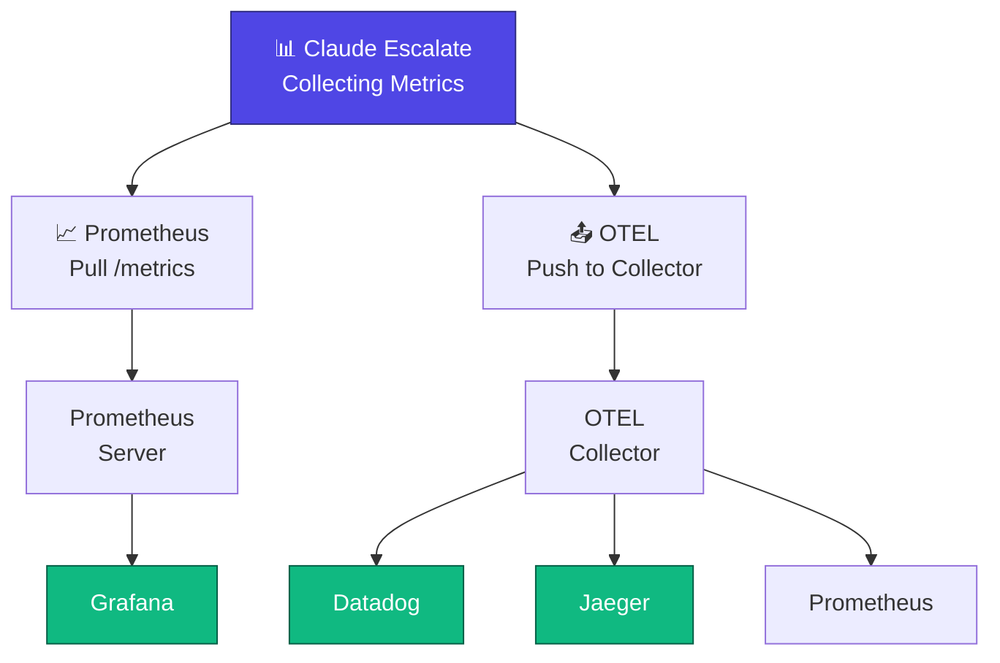

# Metrics & Monitoring (v0.5.0)

## Overview

Claude Escalate exports metrics for monitoring cache performance, token savings, security events, and system health. Two formats:
- **Prometheus**: `http://localhost:8080/metrics` (pull-based scraping)
- **OpenTelemetry**: Push metrics to collector (configurable push interval)

## Metrics Export Architecture



## Web Dashboard

Access dashboard at **http://localhost:8080/dashboard** for real-time visualization of metrics and configuration.

## Metrics Collection

### Core Metrics

| Metric | Type | Description | Example |
|--------|------|-------------|---------|
| `requests_total` | Counter | Total requests processed | 1,247 |
| `cache_hit_rate` | Gauge | Percentage of cache hits | 52.3% |
| `token_savings_percent` | Gauge | Average token reduction | 42% |
| `latency_ms` | Histogram | Request latency in milliseconds | P50: 45ms, P99: 200ms |
| `tokens_sent` | Counter | Input tokens to Claude | 645,000 |
| `tokens_received` | Counter | Output tokens from Claude | 125,000 |
| `estimated_cost` | Gauge | Monthly cost estimate | $18.50 |
| `cost_savings` | Gauge | Monthly savings estimate | $25.30 |

### Cache Metrics

| Metric | Type | Example |
|--------|------|---------|
| `cache_exact_hits` | Counter | 245 exact dedup hits |
| `cache_semantic_hits` | Counter | 342 semantic cache hits |
| `cache_false_positives` | Counter | 1 incorrect response |
| `cache_false_positive_rate` | Gauge | 0.09% |
| `cache_entries` | Gauge | 1,247 cached responses |
| `cache_memory_mb` | Gauge | 42.3 MB memory used |

### Graph Metrics

| Metric | Type | Example |
|--------|------|---------|
| `graph_queries_total` | Counter | 156 graph queries |
| `graph_query_hits` | Counter | 128 answered by graph |
| `graph_query_misses` | Counter | 28 required Claude |
| `graph_query_latency_ms` | Histogram | P99: 12ms |
| `graph_nodes_total` | Gauge | 1,247 indexed nodes |
| `graph_relationships_total` | Gauge | 3,542 relationships |

### Security Metrics

| Metric | Type | Example |
|--------|------|---------|
| `injections_blocked` | Counter | 47 SQL injection attempts |
| `xss_blocked` | Counter | 12 XSS attempts |
| `command_injection_blocked` | Counter | 8 command injection attempts |
| `rate_limit_triggers` | Counter | 3 rate limit violations |
| `invalid_requests` | Counter | 22 malformed requests |

### Optimization Metrics

| Metric | Type | Example |
|--------|------|---------|
| `input_optimization_tokens_saved` | Counter | 18,450 tokens |
| `input_optimization_percent` | Gauge | 42% |
| `tool_strip_tokens_saved` | Counter | 7,200 tokens |
| `param_compression_tokens_saved` | Counter | 5,100 tokens |
| `formatting_tokens_saved` | Counter | 3,600 tokens |
| `whitespace_tokens_saved` | Counter | 2,550 tokens |

## Export Formats

### 1. Prometheus Format

Endpoint: `http://localhost:8080/metrics`

Metrics in Prometheus text format:

```
# HELP requests_total Total requests processed
# TYPE requests_total counter
requests_total 1247

# HELP cache_hit_rate Cache hit rate percentage
# TYPE cache_hit_rate gauge
cache_hit_rate 52.3

# HELP token_savings_percent Average token reduction percentage
# TYPE token_savings_percent gauge
token_savings_percent 42

# HELP cache_entries Current cached responses
# TYPE cache_entries gauge
cache_entries 1247

# HELP graph_nodes_total Total indexed code nodes
# TYPE graph_nodes_total gauge
graph_nodes_total 1247

# HELP injections_blocked Total injection attacks blocked
# TYPE injections_blocked counter
injections_blocked 47
```

**Prometheus Scrape Configuration**:

```yaml
# prometheus.yml
global:
  scrape_interval: 15s

scrape_configs:
  - job_name: 'claude-escalate'
    static_configs:
      - targets: ['localhost:8080']
    metrics_path: '/metrics'
```

### 2. OpenTelemetry Push (OTEL)

Push metrics to OpenTelemetry Collector via OTLP gRPC protocol.

Configure in `config.yaml`:

```yaml
metrics:
  enabled: true
  
  otel:
    enabled: true
    endpoint: "http://localhost:4317"    # OTLP gRPC endpoint
    service_name: "claude-escalate"
    environment: "production"
    version: "0.5.0"
    push_interval_seconds: 30
    
    # Optional: TLS for secure connection
    tls_enabled: false
    
    # Optional: Authentication headers
    headers:
      Authorization: "Bearer YOUR_TOKEN"
```

**Metrics pushed to OTEL Collector**:

All metrics listed above are pushed as OpenTelemetry metric types:
- **Counters**: requests_total, cache_exact_hits, injections_blocked, tokens_sent
- **Gauges**: cache_hit_rate, token_savings_percent, graph_nodes_total, cache_memory_mb
- **Histograms**: latency_ms (with P50, P95, P99 percentiles)

**OTEL Collector Configuration** (example):

```yaml
# otel-collector-config.yaml
receivers:
  otlp:
    protocols:
      grpc:
        endpoint: 0.0.0.0:4317

processors:
  batch:
    timeout: 10s
    send_batch_size: 100

exporters:
  prometheus:
    endpoint: "0.0.0.0:8888"
  
  otlp:
    endpoint: "datadog-agent:4317"

service:
  pipelines:
    metrics:
      receivers: [otlp]
      processors: [batch]
      exporters: [prometheus, otlp]
```

### 3. JSON Export

Endpoint: `http://localhost:8080/api/metrics/export`

```json
{
  "timestamp": "2026-04-27T12:30:45Z",
  "period_seconds": 3600,
  
  "requests": {
    "total": 1247,
    "per_second": 0.35
  },
  
  "cache": {
    "hit_rate": 52.3,
    "exact_hits": 245,
    "semantic_hits": 342,
    "false_positive_rate": 0.09,
    "entries": 1247,
    "memory_mb": 42.3
  },
  
  "graph": {
    "queries_total": 156,
    "hits": 128,
    "misses": 28,
    "latency_p99_ms": 12,
    "nodes": 1247,
    "relationships": 3542
  },
  
  "optimization": {
    "input_tokens_saved": 18450,
    "input_savings_percent": 42,
    "by_layer": {
      "tool_strip": 7200,
      "param_compression": 5100,
      "formatting": 3600,
      "whitespace": 2550
    }
  },
  
  "security": {
    "injections_blocked": 47,
    "xss_blocked": 12,
    "command_injection_blocked": 8,
    "rate_limit_triggers": 3
  },
  
  "cost": {
    "tokens_sent": 645000,
    "tokens_received": 125000,
    "estimated_monthly": 18.50,
    "estimated_savings": 25.30
  }
}
```

## Real-Time Streaming (WebSocket)

Optional WebSocket endpoint for real-time metrics:

```
ws://localhost:8080/api/metrics/stream
```

Provides metrics every 1 second to connected clients (for dashboard).

**Note**: Production monitoring should use Prometheus scraping or OTEL push, not WebSocket streaming.

## Grafana Integration

### 1. Add Prometheus Data Source

```yaml
# Grafana UI: Configuration → Data Sources → Add Prometheus

name: Claude Escalate
url: http://localhost:9090
```

### 2. Import Dashboard

Create dashboard with these panels:

```
Panel 1: Request Rate (rate(requests_total[5m]))
Panel 2: Cache Hit Rate (cache_hit_rate)
Panel 3: Token Savings (token_savings_percent)
Panel 4: Latency (histogram_quantile(0.99, latency_ms))
Panel 5: Cost Estimate (estimated_cost)
Panel 6: Security Events (sum(injections_blocked))
```

### 3. Alerting

```yaml
# prometheus.yml alerts
alert_rules:
  - alert: HighFalsePositiveRate
    expr: cache_false_positive_rate > 0.005  # >0.5%
    annotations:
      summary: "Cache false positive rate exceeds 0.5%"
      
  - alert: LowCacheHitRate
    expr: cache_hit_rate < 0.30  # <30%
    annotations:
      summary: "Cache hit rate below 30% target"
      
  - alert: SecurityThreat
    expr: injections_blocked > 10  # >10 per minute
    annotations:
      summary: "High number of injection attempts detected"
```

## CLI Commands

### View Metrics

```bash
# Show current metrics
claude-escalate metrics --now

# Show historical metrics (last 24h)
claude-escalate metrics --history

# Show specific metric
claude-escalate metrics --key cache_hit_rate

# Watch metrics in real-time
claude-escalate metrics --watch
```

### Export Metrics

```bash
# Export to JSON
claude-escalate metrics export --format json > metrics.json

# Export to CSV
claude-escalate metrics export --format csv > metrics.csv

# Export specific date range
claude-escalate metrics export --from "2026-04-27" --to "2026-04-28"
```

## Configuration

```yaml
metrics:
  enabled: true
  
  # Retention policy
  retention:
    days: 90
    cleanup_interval_hours: 24
  
  # Collection interval
  collection_interval_seconds: 1
  
  # Export formats
  export:
    prometheus: true   # Prometheus /metrics endpoint
    otel: true         # OpenTelemetry push
  
  # Performance settings
  max_entries_in_memory: 10000
  batch_export_size: 100
  
  # Prometheus endpoint
  prometheus:
    port: 8080
    path: "/metrics"
  
  # OpenTelemetry push
  otel:
    enabled: true
    endpoint: "http://localhost:4317"
    service_name: "claude-escalate"
    environment: "production"
    push_interval_seconds: 30
    
    # Optional: TLS
    tls_enabled: false
    
    # Optional: Authentication
    headers: {}
      # Authorization: "Bearer YOUR_TOKEN"
```

## Troubleshooting

### Metrics not updating

```bash
# Check if metrics collection is enabled
claude-escalate config get metrics.enabled

# View logs
tail -f ~/.claude-escalate/metrics.log

# Verify endpoint is accessible
curl http://localhost:8080/metrics
```

### High false positive rate

If `cache_false_positive_rate > 0.5%`:

```bash
# Increase semantic cache threshold (stricter)
claude-escalate config set cache.semantic_threshold 0.90

# Disable semantic cache temporarily
claude-escalate config set cache.semantic_enabled false

# Rebuild cache
claude-escalate cache rebuild
```

### OTEL connection failures

```bash
# Verify OTEL collector is running
telnet localhost 4317

# Check OTEL configuration
claude-escalate config get metrics.otel

# View OTEL push logs
tail -f ~/.claude-escalate/otel.log
```

## Best Practices

1. **Monitor cache false positives** — Alert if rate >0.5%
2. **Track token savings over time** — Watch for degradation
3. **Alert on security events** — Investigate spike in injections
4. **Set up Grafana dashboards** — Visualize trends
5. **Export metrics regularly** — Archive for long-term analysis
6. **Use OTEL for enterprise** — Standard observability platform
